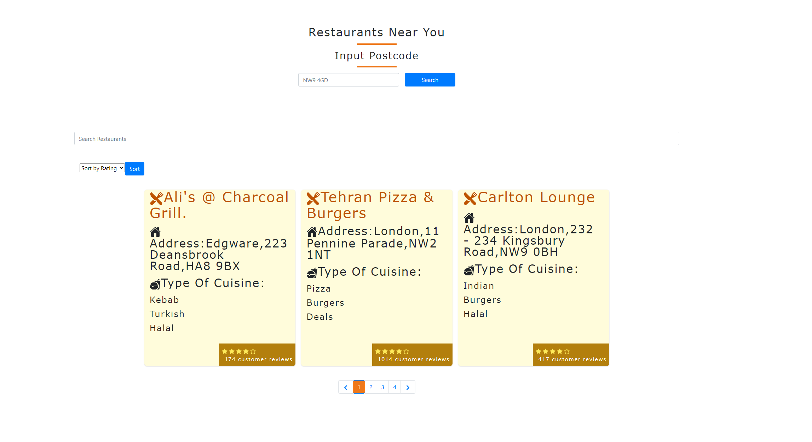

# Just Eat App

## Description

This just eat app provide users 10 restaurants based on a postcode to help you find the best food around. Essential information such as name, rating, cuisines are displayed.

## Table of Contents (Optional)

- [Installation](#installation)
- [Usage](#usage)
- [Improvements](#Improvements)
- [Assumptions](#Assumptions)
- [License](#license)

## Installation

Open the website and type in a postcode to look for the best restaurant available around you!

## Usage

In order to use the api through a web application, access will be blocked by CORS policy. I have installed a chrome plugin called Moesif CORS to get around this issue to access the api call.

Link to application: https://justeat-app.netlify.app/
Link to github repo: https://github.com/ccc7321/justeatapp

## Improvements

1. Remove the need for a chrome plugin to access the JustEat API
2. Fix the search bar. The search bar currently only works on page one, and as soon as you type in any subsequent pages, the web page will break and will need to use the reset button to reset the whole app.
3. New and permanent filters. Pull all the avaiable cuisines into a permanent array then pass that information into a filter to show what cuisines are available.
4. Show the restaurant that are either open/close, part of the object has this value which will help build this functionality.
5. The styling of this application in general can use more work.
6. i have used a mixed of css styling (bootstrap and stlyed component) which makes it looks a bit messy

## Assumptions

1. I relied on axios for the error handling when the api is being called.
2. I assumed that on the data fetch from the api call is correct.

## License

Please refer to licence in the repo.

---
